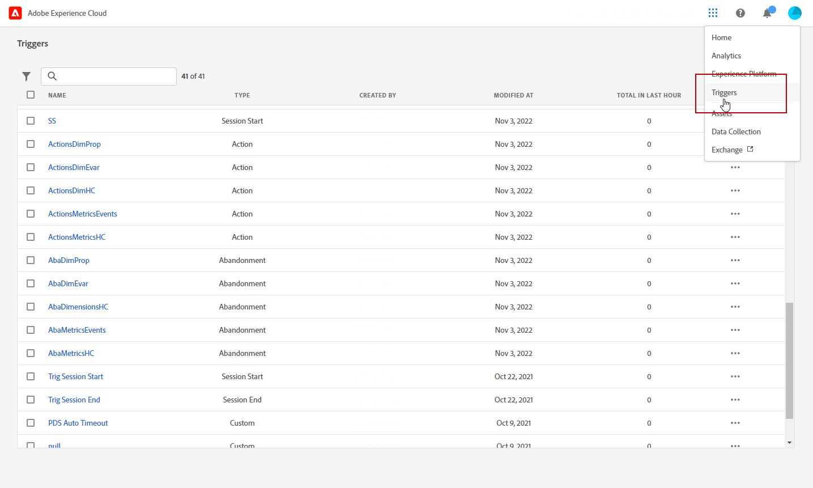
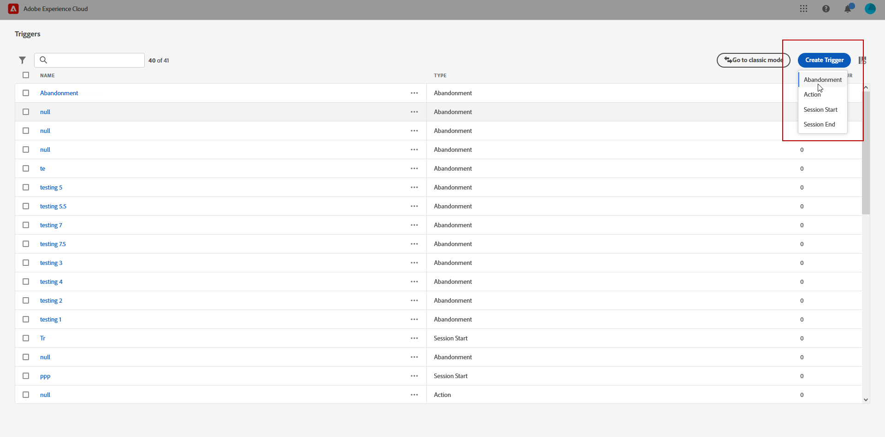
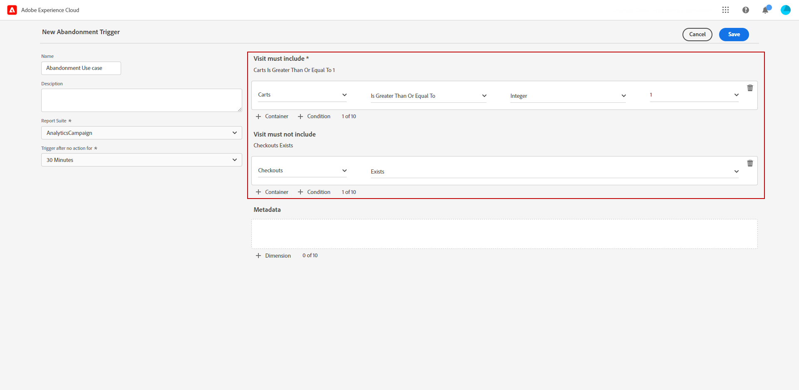
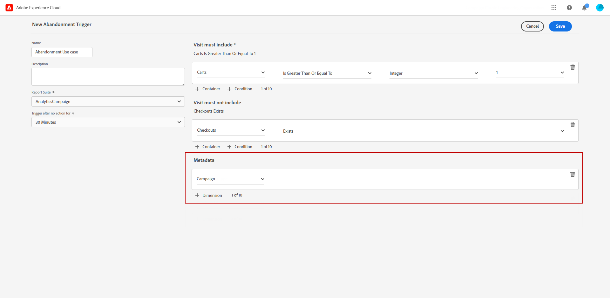
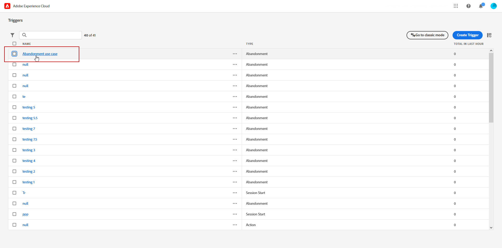
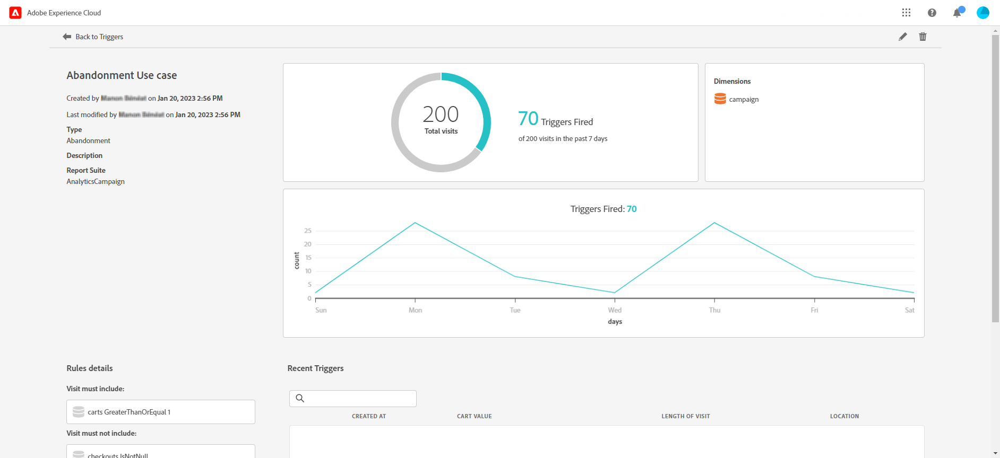

# Skapa en Experience Cloud-utlösare {#create-triggers}

>[!NOTE]
>
> Det nya användargränssnittet för Experience Cloud Triggers ger en intuitiv upplevelse för att hantera konsumentbeteenden och personalisera användarupplevelser. Klicka på knappen **[!UICONTROL Go to classic mode]** -knappen.

Skapa en utlösare och konfigurera villkoren för utlösaren. Du kan till exempel ange villkor för en utlösares regler under ett besök, till exempel mått som Cart Abandon eller dimensioner som produktnamnet. När reglerna är uppfyllda körs utlösaren.

1. I Experience Cloud väljer du menyn för lösningsväljaren och sedan **[!UICONTROL Triggers]**.

   

1. På startsidan för Utlösare klickar du på **[!UICONTROL Create Trigger]** anger du sedan typ av utlösare.

   Det finns tre typer av utlösare:

   * **[!UICONTROL Abandonment]**: Du kan skapa en utlösare som aktiveras när en besökare tittar på en produkt men inte lägger till något i kundvagnen.

   * **[!UICONTROL Action]**: Du kan skapa utlösare, till exempel, som aktiveras efter anmälan till nyhetsbrev, e-postprenumerationer eller program för kreditkort (bekräftelser). Om du är återförsäljare kan du skapa en utlösare för en besökare som registrerar sig för ett lojalitetsprogram. I media och underhållning skapar du triggers för besökare som tittar på en viss show och kanske vill svara med en enkät.

   * **[!UICONTROL Session Start and Session End]**: Skapa en utlösare för händelser för sessionsstart och sessionsslut.

   

1. Lägg till en **[!UICONTROL Name]** och **[!UICONTROL Description]** till utlösaren.

1. Välj Analytics **[!UICONTROL Report Suite]** används för den här utlösaren. Den här inställningen identifierar de rapportdata som ska användas.

   [Läs mer om Report Suite](https://experienceleague.adobe.com/docs/analytics/admin/admin-tools/manage-report-suites/c-new-report-suite/t-create-a-report-suite.html){target="_blank"}.

1. Välj **[!UICONTROL Trigger after no action for]** giltighetsperiod.

1. Från **[!UICONTROL Visit must include]** och **[!UICONTROL Visit must not include]** -kategorier kan du definiera villkor eller besökarbeteenden som du vill eller inte vill ska inträffa. Du kan ange **Och** eller **eller** logik inom eller mellan villkor, beroende på vilka kriterier du anger.

   Regler för en enkel utlösare för övergivna varukorgar kan till exempel vara:

   * **[!UICONTROL Visit must include]**: `Carts (metric) Is greater or equal to 1` för att rikta in sig på besökare med minst en artikel i kundvagnen.
   * **[!UICONTROL Visit must not include]**: `Checkout (metric) Exists.` för att ta bort besökare som köpt artiklarna i sina kundvagnar.

   

1. Klicka **[!UICONTROL Container]** för att skapa och spara regler, villkor eller filter som definierar en utlösare. Om du vill att händelser ska inträffa samtidigt bör du placera dem i samma behållare.

   Varje behållare bearbetas oberoende vid träffnivån, vilket innebär att om två behållare förenas med **[!UICONTROL And]** -operatorn är reglerna endast giltiga när två träffar uppfyller kraven.

1. Från **[!UICONTROL Metadata]** fält, klicka **[!UICONTROL + Dimension]** för att välja en viss Campaign-dimension eller variabler som är relevanta för besökarens beteende.

   

1. Klicka på **[!UICONTROL Save]**.

1. Välj din nyskapade **[!UICONTROL Trigger]** från listan för att få tillgång till detaljrapporten om utlösaren.

   

1. Från den detaljerade vyn av utlösaren kan du få tillgång till rapporter om hur många utlösare som har utlösts. Om det behövs kan du redigera utlösaren med pennikonen.

   
